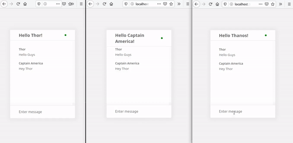

# Adonis Web Socket Chat

Just run:

`$ adonis serve`

Access `http://localhost:3333/`

Type your name and press <kbd>Enter</kbd>

Open multiple tabs to see simulate other users.

  

This project was made using the [official Adonis docs](https://adonisjs.com/docs/4.1/websocket)

